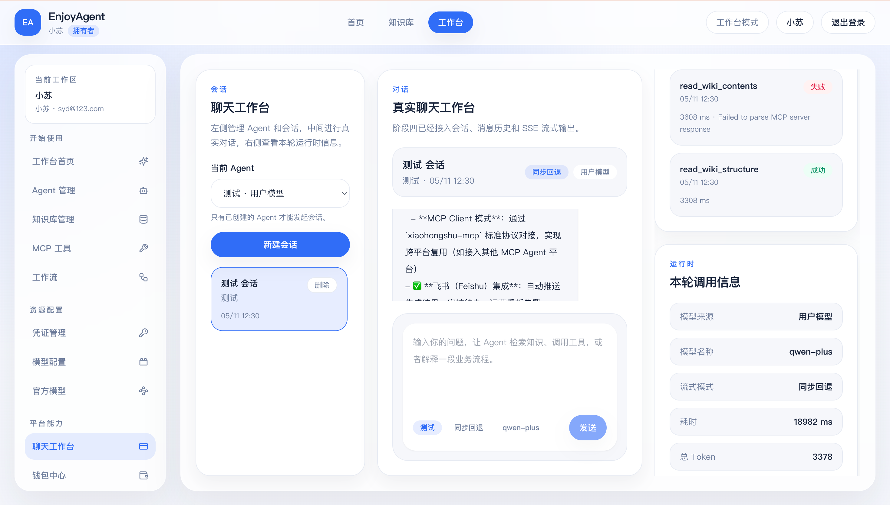
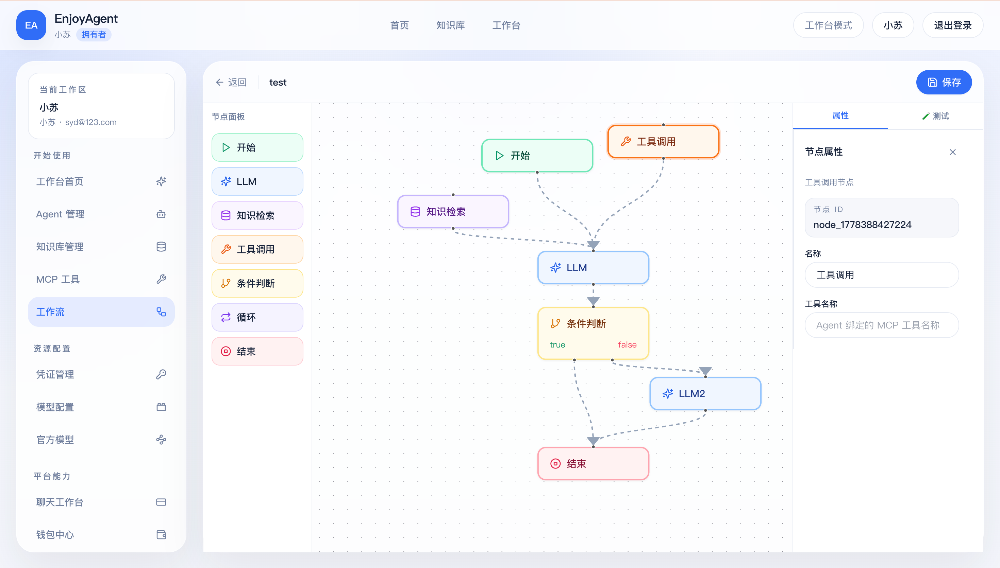
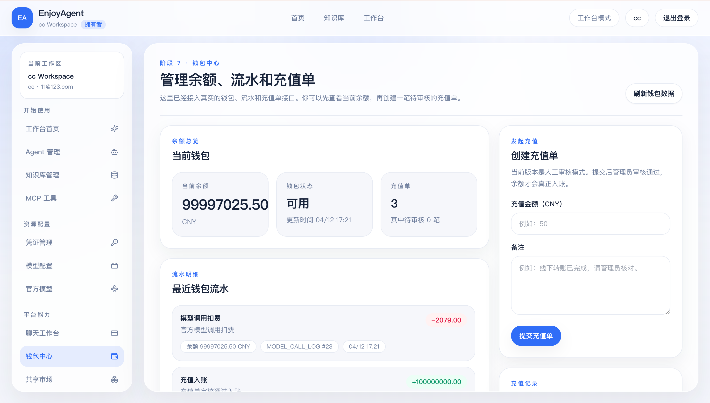

# EnjoyAgent Frontend

[](https://vuejs.org/)
[](https://www.typescriptlang.org/)
[](https://vite.dev/)

EnjoyAgent 的 Web 客户端，包含用户工作台和管理后台。后端仓库见
[rs8bits/EnjoyAgent](https://github.com/rs8bits/EnjoyAgent)。

## 功能

- 用户注册、登录与 HttpOnly Cookie 会话
- Agent、凭证、用户模型和官方模型管理
- SSE 流式聊天、会话历史、知识检索结果和 MCP 工具调用轨迹
- 知识库、文档上传和索引状态管理
- MCP Server、OAuth、工具目录和 Agent 工具绑定
- 可视化工作流编辑、测试运行和执行历史
- 钱包、充值单、共享市场和管理员审核

## 界面预览

### 聊天工作台



### 工作流画布



### 钱包中心



## 技术栈

- Vue 3、TypeScript、Vue Router、Pinia
- Vite 8、Tailwind CSS
- Vue Flow、Lucide Vue Next
- Axios、Vitest、ESLint

## 本地开发

### 环境要求

- Node.js `20.19+`，或 `22.12+`
- npm 10
- EnjoyAgent 后端运行在 `http://127.0.0.1:8080`

### 启动

```bash
git clone https://github.com/rs8bits/EnjoyAgent-frontend.git
cd EnjoyAgent-frontend
npm ci
cp .env.example .env
npm run dev
```

浏览器访问 `http://127.0.0.1:5173`。开发服务器会把 `/api` 代理到
`VITE_PROXY_TARGET`，默认值为 `http://localhost:8080`。

### 环境变量

| 变量 | 默认值 | 说明 |
| --- | --- | --- |
| `VITE_API_BASE_URL` | 空 | API 基础地址；留空时使用同源 `/api` |
| `VITE_PROXY_TARGET` | `http://localhost:8080` | 本地开发和预览时的 API 代理目标 |

## 常用命令

```bash
npm run dev        # 启动开发服务器
npm run lint       # ESLint
npm run typecheck  # TypeScript / Vue 类型检查
npm test           # 运行 Vitest
npm run build      # 类型检查并生成 dist
npm run preview    # 本地预览构建结果
```

## 构建与部署

```bash
npm ci
npm run build
```

构建产物位于 `dist/`。部署时建议让页面和 `/api` 使用同一域名，并由 Nginx、
Caddy 或其他反向代理把 `/api` 转发到后端。Vite 开发服务器和 `preview` 只用于
本地开发或短时验收。

跨域部署时，需要在后端精确配置允许的浏览器 Origin，并保持生产 Cookie 的
`Secure` 属性开启。不要把模型密钥写入 `VITE_*` 环境变量；这些变量会进入浏览器
构建产物。

## 目录结构

```text
src/app/components   通用组件与工作流节点
src/app/layouts      页面布局
src/app/pages        路由页面
src/app/services     HTTP 与 SSE 客户端
src/app/stores       Pinia 状态
src/app/types        接口类型
src/app/utils        纯函数与业务辅助逻辑
```

## 文档

- [UI-STYLE.md](UI-STYLE.md)：界面风格与组件规范
- [docs/http-only-authentication.md](docs/http-only-authentication.md)：Cookie 会话与请求安全
